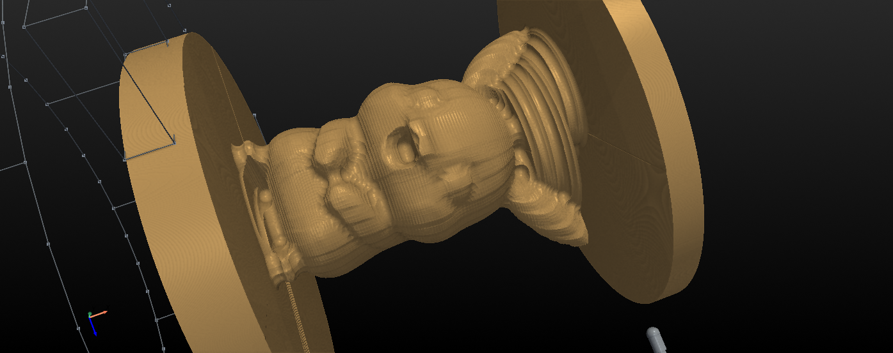
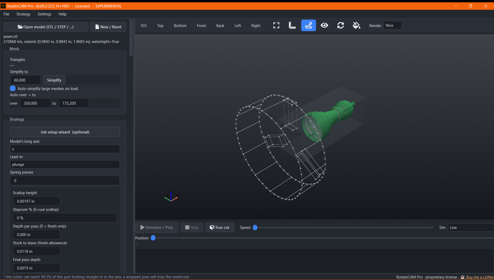
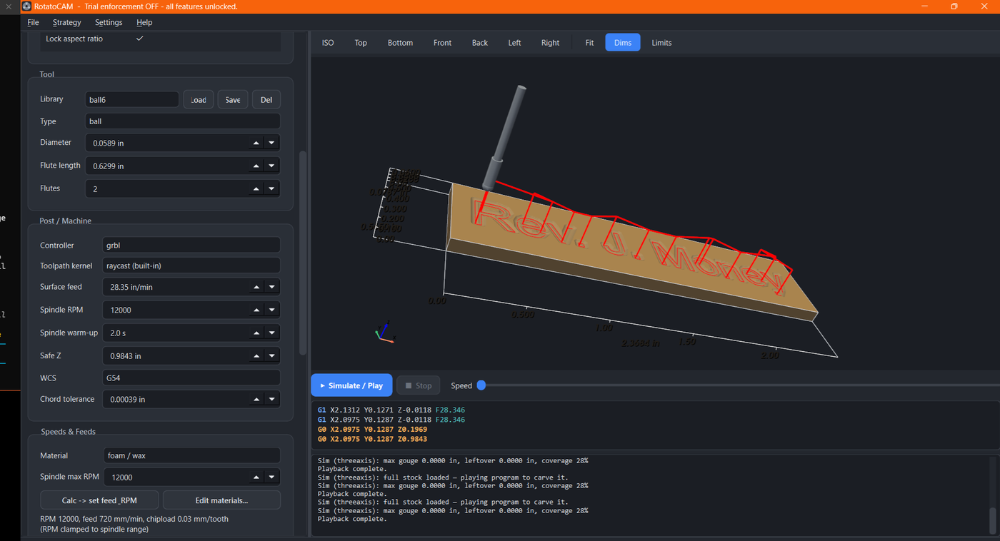

  

# RotatoCAM

**Spin the stock. Read the signal.**

Free (and pro version) 4-axis rotary CAM and G-code generator for DIY CNC. Turn an STL or STEP into
simultaneous 4-axis rotary toolpaths, wrapped engraving, and a verified material-removal
simulation on Windows, without a CAM subscription.

> ⚠️ **EXPERIMENTAL.** RotatoCAM only writes a G-code file; it does not run your machine,
> and its output is only a suggestion you must verify. CNC machines are dangerous. You alone
> are responsible for inspecting every program, air-cutting first, and operating safely.
> Provided AS-IS, with no warranty.

## Download

Grab the free Community Edition at **[rotatocam.com](https://rotatocam.com/#download)**.
Unzip and run: no install, no license, no expiry.

Everything else lives there too: what it does, the how-to, the gallery, the safe-testing
guide, supported controllers, and RotatoCAM Pro.

## Screenshots

### Pikachu rotary simulation

Material-removal simulation showing the Pikachu model between the remaining stock ends.

### Pawn toolpaths

Rotary toolpath preview with the pawn model and chuck fixture in view.

### Engraving simulation

Engraving playback with the cutter, toolpath, and G-code readout visible.

---

Built in Myrtle Beach by Rev. J. Money · **https://rotatocam.com/** · therealrevjmoney@gmail.com
